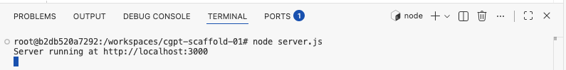
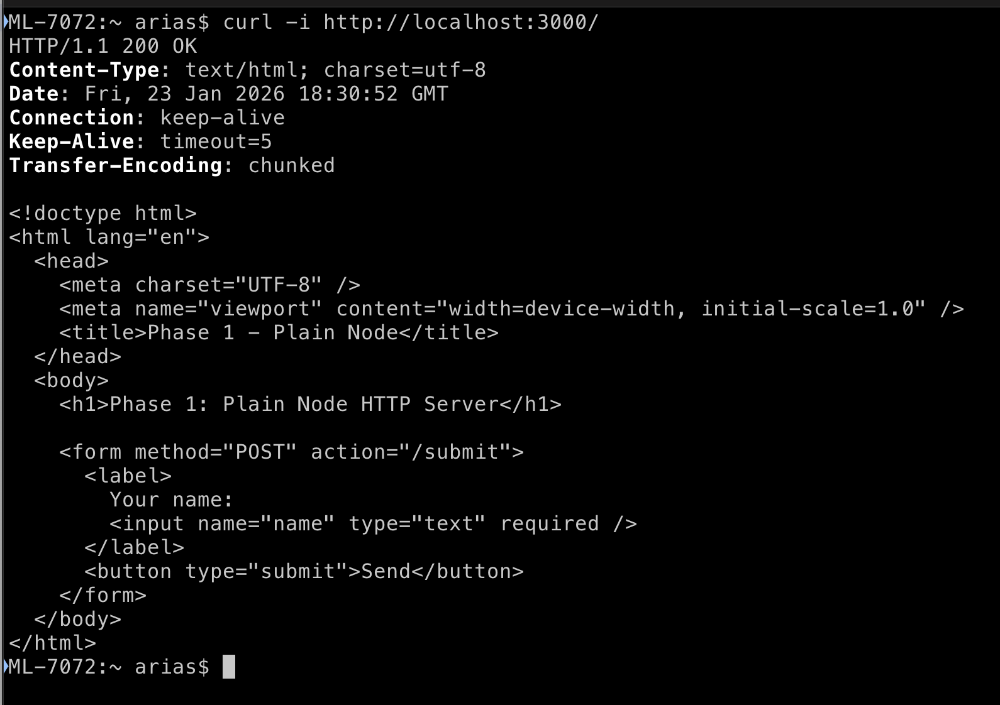
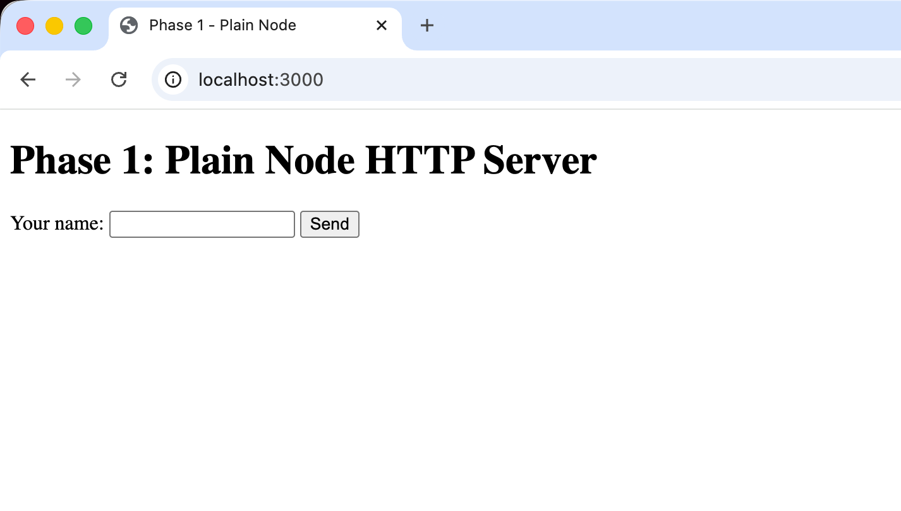
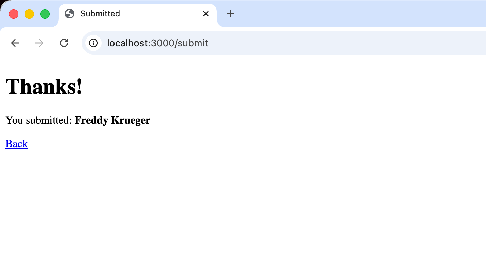
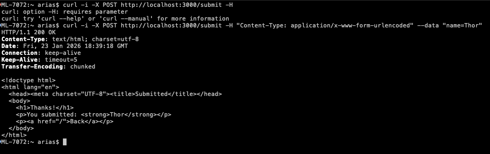

# Instructions for the Scaffolded Node Application

The idea is to build this app incrementaly.

# Phase 0

- Remember to setup git and github to be able to push and pull

The steps to follow are:
1. Create a repository in your GitHub account, call it `scaffolded-books`
    1. Remember to add a README file
    1. Remember to add a .gitignore for Node
2.	Clone this repository into your computer (Remember where you cloned it)
3.	Move to the directory where you cloned your repository (most likely `/development/scaffolded-books`)
4.	Run the following command

    `mkdir -p .devcontainer`
5. Create the following two files:
    1. `.devcontainer/Dockerfile`
    2. `.devcontainer/devcontainer.json`
6. Write the following code on the `Dockerfile` file
```dockerfile
# .devcontainer/Dockerfile
FROM node:20-bookworm

# Optional: install a few useful tools
RUN apt-get update && apt-get install -y --no-install-recommends \
    git \
    curl \
  && rm -rf /var/lib/apt/lists/*

# Workspace folder (VS Code will mount your repo here)
WORKDIR /workspaces

# Ensure Node/npm versions visible
RUN node -v && npm -v
```
7. Write the following code on the `devcontainer.json` file
```json
{
  "name": "Node Scaffold (Phase-0)",
  "build": {
    "dockerfile": "Dockerfile"
  },
  "workspaceFolder": "/workspaces/${localWorkspaceFolderBasename}",

  "customizations": {
    "vscode": {
      "extensions": [
        "dbaeumer.vscode-eslint",
        "esbenp.prettier-vscode"
      ]
    }
  },

  "forwardPorts": [3000],
  "portsAttributes": {
    "3000": {
      "label": "Node app",
      "onAutoForward": "notify"
    }
  },

  "postCreateCommand": "node -v && npm -v"
}
```
8. Verify that the `.gitignore` file correctly ignores Node related binaries.
9. Add to the `.gitignore` the following lines at the end:
```
# OS / Editor
.DS_Store
.vscode/
```
10. Create a file `./.editorconfig` (This file is in your repo's root). Write the following code into it:
```ini
root = true

[*]
end_of_line = lf
insert_final_newline = true
charset = utf-8

[*.{js,json,md}]
indent_style = space
indent_size = 2
```

11. Now, in the terminal, while in the repo's root directory type: `code .` this will open Visual Studio Code in the current directory. This has the same effect as opening Visual Studio Code (VSC) and then opening that folder.
12. VSC will tell you "Folder contains a Dev Container configuration..." Click on the button that says "Reopen in Container." This will make VSC read the configuration files we just wrote before, and interact with Docker to create a container for our application. From now on, you will work on that container and not "on your computer"
13. Within VSC create a file `smoke.js` and type the following code:
```js
// smoke.js

const http = require("http");

const server = http.createServer((req, res) => {
  res.writeHead(200, { "Content-Type": "text/plain" });
  res.end("Phase-0 smoke test OK\n");
});

server.listen(3000, "0.0.0.0", () => {
  console.log("Listening on http://0.0.0.0:3000");
});

```
14. Run your mini-program, open a Terminal from within VSC and run:
```bash
node smoke.js
```
15. You can open a web browser on your computer and type this url: `http://localhost:3000` You should get a message that reads "Phase-0 smoke test OK"
16. You now can commit and push, run the following commands:
```bash
git add .
git commit -m "Phase-0: devcontainer + dockerized Node environment"
git tag phase-0
git tag
git push --tags

```

# Phase 1: HTTP Node App, no frameworks

1. Remove `smoke.js`
2. Add the following files
   1. `server.js`
   2. `public/index.html`
3. Review the following files
   1. `README.md`
   2. `.gitignore`
4. Add the following code to `index.html`
```html
<!doctype html>
<html lang="en">
  <head>
    <meta charset="UTF-8" />
    <meta name="viewport" content="width=device-width, initial-scale=1.0" />
    <title>Phase 1 - Plain Node</title>
  </head>
  <body>
    <h1>Phase 1: Plain Node HTTP Server</h1>

    <form method="POST" action="/submit">
      <label>
        Your name:
        <input name="name" type="text" required />
      </label>
      <button type="submit">Send</button>
    </form>
  </body>
</html>
```
5. Add the following code to `server.js`
```js
const http = require("http");
const fs = require("fs");
const path = require("path");
const { URLSearchParams } = require("url");

const PORT = process.env.PORT || 3000;

function send(res, statusCode, body, contentType = "text/html; charset=utf-8") {
  res.writeHead(statusCode, { "Content-Type": contentType });
  res.end(body);
}

function readFileSafe(filePath) {
  return fs.readFileSync(filePath, "utf8");
}

const server = http.createServer((req, res) => {
  const method = req.method || "GET";
  const url = req.url || "/";

  // Serve the form
  if (method === "GET" && url === "/") {
    const filePath = path.join(__dirname, "public", "index.html");
    try {
      const html = readFileSafe(filePath);
      return send(res, 200, html);
    } catch (err) {
      return send(res, 500, "<h1>500</h1><p>Could not load index.html</p>");
    }
  }

  // Handle form submission
  if (method === "POST" && url === "/submit") {
    let body = "";

    req.on("data", (chunk) => {
      body += chunk.toString("utf8");
      // simple safety limit (1MB)
      if (body.length > 1_000_000) req.destroy();
    });

    req.on("end", () => {
      const params = new URLSearchParams(body);
      const name = (params.get("name") || "").trim();

      const safeName = name
        .replaceAll("&", "&amp;")
        .replaceAll("<", "&lt;")
        .replaceAll(">", "&gt;");

      return send(
        res,
        200,
        `<!doctype html>
<html lang="en">
  <head><meta charset="UTF-8"><title>Submitted</title></head>
  <body>
    <h1>Thanks!</h1>
    <p>You submitted: <strong>${safeName || "(empty)"}</strong></p>
    <p><a href="/">Back</a></p>
  </body>
</html>`
      );
    });

    return;
  }

  // Everything else
  send(res, 404, "<h1>404</h1><p>Not found</p>");
});

server.listen(PORT, "0.0.0.0", () => {
  console.log(`Server running at http://localhost:${PORT}`);
});
```
6. Test it
   1. Run the server: `node server.js`
   
   

   2. Do a get request: `curl -i http://localhost:3000/`

   

   3. Do another get request from a browser using the URL above

  

   4. Do a post request from the page you got in previous step
  
  

   5. Do a post request: 
   ```bash
   curl -i -X POST http://localhost:3000/submit \
    -H "Content-Type: application/x-www-form-urlencoded" \
    --data "name=Thor"
   ```

  

7. Track your changes
   ```bash
   git add server.js public/index.html
   git commit -m "Phase 1: Plain Node HTTP server with form and POST"
   git tag phase-1
   git push
   git push --tags
   ```

## Things to note
- Why do you think it uses `0.0.0.0` for the server?
- Why do you think we need to the `.replaceAll("&", "&amp;")`?

# Phase 2: Express-based Server

Our application in the previous phase had a lot of code and we needed to understand many low-level details from Node. This time we will use a framework that will help us streamline our web application development.

## What will remain the same?

* The Docker container and its configuration
* The port we will use, still 3000
* The HTML form on `public/index.html`
* The response flow of the POST request

## What will be the new changes?

| Phase 1 (Plain Node HTTP) | Phase 2 (Node + Express) |
| ------------------------- | ------------------------ |
| `http.createServer`       | `express()`              |
| Manual routing            | `app.get`, `app.post`    |
| Manual body parsing.      | `express.urlencoded()`   |
| Manual response headers   | `res.send()`             |
| Explicit server callback  | Declarative middleware   |


## High Level Steps
1. Add Express as a dependency
2. Update `server.js` to use Express
3. Keep identical behavior as Phase 1
4. Run, test, tag.

The detailed steps follow.

1. Install Express
```bash
npm init -y
npm install express
```
This will create the file`package.json`,  `package-lock.json`, and `node_modules`.

2. Change `server.js` to have the code below
```js
const express = require("express");
const path = require("path");

const PORT = process.env.PORT || 3000;
const app = express();

/*
 * Middleware: parse application/x-www-form-urlencoded
 * This replaces our manual req.on("data") logic from Phase 1
 */
app.use(express.urlencoded({ extended: false }));

/*
 * GET /
 * Serve the HTML form
 */
app.get("/", (req, res) => {
  res.sendFile(path.join(__dirname, "public", "index.html"));
});

/*
 * POST /submit
 * Handle form submission
 */
app.post("/submit", (req, res) => {
  const name = (req.body.name || "").trim();

  const safeName = name
    .replaceAll("&", "&amp;")
    .replaceAll("<", "&lt;")
    .replaceAll(">", "&gt;");

  res.send(`<!doctype html>
<html lang="en">
  <head><meta charset="UTF-8"><title>Submitted</title></head>
  <body>
    <h1>Thanks!</h1>
    <p>You submitted: <strong>${safeName || "(empty)"}</strong></p>
    <p><a href="/">Back</a></p>
  </body>
</html>`);
});

/*
 * Start server
 */
app.listen(PORT, "0.0.0.0", () => {
  console.log(`Express server running at http://localhost:${PORT}`);
});
```

3. Test (Just like Phase 1)
   1. Run the server: `node server.js`
   
   

   2. Do a get request: `curl -i http://localhost:3000/`

   

   3. Do another get request from a browser using the URL above

  

   4. Do a post request from the page you got in previous step
  
  

   5. Do a post request: 
   ```bash
   curl -i -X POST http://localhost:3000/submit \
    -H "Content-Type: application/x-www-form-urlencoded" \
    --data "name=Thor"
   ```

  
